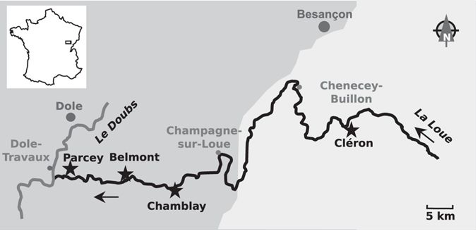

## Overview  

This tutorial will introduce you to Microbiota data analysis and guide you through the analyses, visualization and interpretation of microbial community composition and diversity.  
  
  
## Objectives  
- Be able to analyse, visualize and interpret microbiota data  
  
## Learning objectives  
By the end of this tutorial you should be able to:  
- Address sparsity, undersampling and uneven sampling depth using data filtering and normalization  
- Visualize and interpret microbial community composition  
- Define, calculate, and interpret alpha- and beta-diversity of microbial communities  
- Generate and interpret multivariate analyses   
  
## Context, scientific question and data sets  
Epilithic river biofilms are complex matrix-enclosed communities harboring a great diversity of prokaryotic and eukaryotic microorganisms. Deciphering the microbial community composition in river biofilms and identifying the impacts of environmental factors on these communities are of particular importance for attaining a better understanding of the functioning of riverine biofilms.      

### Scientific context
In this tutorial, we will investigate how bacterial communities within epilithic biofilms from the Loue River in France change along the river and over time (using a subset of the data previously published in [Zancarini et al. 2017, Scientific Reports 7:4344](https://www.nature.com/articles/s41598-017-04016-w). We will compare bacterial diversity and composition within biofilms harvested in two different sites (Cleron, located at the upstream area of the river, and Parcey, located at the downstream area of the river) and over the summer 2012 (*i.e.* July, August and September). For each site and harvesting time point, three samples were harvested. Then, DNA was extracted for each sample and the 16S gene was amplified and sequenced using 454-pyrosequencing.     

Below are displayed a map of the sampling sites (from Zancarini et al. 2017) and the Loue at Cléron (source Wikipedia).  

###  Datasets

A first bioinformatical analysis was required to create the occurence table based on the raw sequencing data given by the sequencing company. Usually, the *biom* format is used as an output format for this first analysis. The *biom* format has been developed to support encapsulation of core study data (occurence table data and sample/observation metadata) in a single file. Similar to the *biom* format, the *phyloseq* format also uses a single file containing the three tables. Microbial ecologists usually use Vegan and/or Phyloseq packages to analyse the occurence table.  

To limit the number of packages used in this tutorial, the data sets are not in `biom` format but in `txt` (tabulation separated values) and consist of three different data files which will be converted to a single `phyloseq` file format:  
  1. An OTU table: `data_loue_16S_nonnorm.txt`  
  2. A sample metadata table: `data_loue_16S_nonnorm_grp.txt`  
  3. A taxonomy table: `data_loue_16S_nonnorm_taxo.txt`  
  
## Strategy  
We want to assess if there is any difference between bacterial communities within biofilms harvested in the upper (*Cleron*) and in the downstream (*Parcey*) area of the Loue River and over time during the summer 2012 (*i.e.* *July*, *August* and *September*). We will follow the following strategy:  
  - Explore the data sets and check data properties (such as sparsity).  
  - Define, calculate and interpret alpha-diversity (*i.e.* richness, evenness and shannon indices).  
  - Filter the data and normalize the data by sample (*i.e.* correction for library size).  
  - Visualize and interpret the bacterial community composition for the different treatments.  
  - Explore the beta-diversity (the differences between samples) using Principal Covariates Analysis (PCoA) and perform a statistical test to test differences between treatments.  

### Teaching materials
This lesson has been formatted according to the [Carpentries Foundation](https://carpentries.org/) lesson template and following their recommendations on how to teach researchers good practices in programming and data analysis.   


